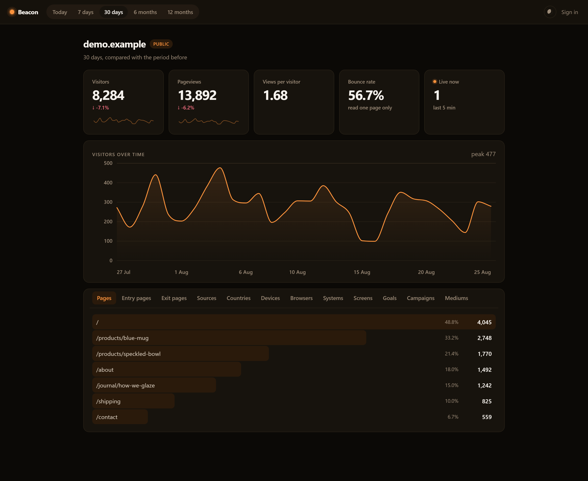

# Beacon


**Privacy-first, cookieless web analytics.** A self-hosted alternative to Google
Analytics that answers what a site owner actually asks — how many people came,
what they read, where they came from — without collecting anything that
identifies them.

No cookies. No personal data at rest. No consent banner, because there is
nothing to consent to.

<br clear="right">



<!-- Once deployed, put the public dashboard URL here. It needs no login. -->

```html
<script src="https://your-host/static/beacon.js" data-site-id="yoursite.com" defer></script>
```

That is the entire integration. The script is **2.3 KB gzipped**.

If your site sends a Content Security Policy, it needs one more step — see [Getting onto a site that has a Content Security Policy](docs/DESIGN.md).

---

## The short version

| | |
| --- | --- |
| **A year of traffic renders in 9.6 ms** | instead of 2,027 ms — **211x**, by pre-aggregating on a daily grain |
| **Bot filtering went 65.5% → 100%** | measured against 2,118 real crawler user-agents; the third it used to miss included `ChatGPT-User`, `Applebot` and `Bytespider` |
| **p99 ingest 915 ms → 91 ms** | moving the write off the request path; worst case 4,249 ms → 135 ms |
| **791 tests, 100% branch coverage of `app/`** | `ruff` and `mypy --strict` clean, run against SQLite *and* Postgres in CI |
| **Zero JavaScript on the dashboard** | charts are server-rendered SVG; the page works with scripting disabled |
| **Read it from anywhere** | `Authorization: Bearer` keys on the stats API — read-only by construction, so a leaked key can pull numbers and change nothing |

Full reasoning, measurements and trade-offs: **[docs/DESIGN.md](docs/DESIGN.md)**.

## The one idea worth stealing

Analytics tools identify visitors with a cookie, which is what makes them a
consent problem. Beacon uses a keyed hash of the visitor's IP address and
User-Agent — but the key is a **salt regenerated every day, and deleted two days
later**.

Once that salt is gone, the mapping cannot be reproduced. Not by an attacker
with a stolen backup, not by a subpoena, not by us. There is no column in the
schema capable of holding an IP address or a raw User-Agent.

The cost is that a visitor is only recognisable *within one day*, so daily
uniques cannot be summed into a monthly figure — a visitor who came on Monday
and Tuesday is two different hashes. That sounds like a limitation and is
actually the load-bearing property: because a day's counts are self-contained,
they can be **pre-aggregated once and added together forever**. The 211x speedup
above falls directly out of the privacy design.

The salts rotate at each site's *local* midnight, not UTC, so a site's "today"
matches the day its visitors are living in.

## Running it

```bash
python -m venv .venv && .venv/Scripts/activate   # source .venv/bin/activate
pip install -e ".[dev]"
python seed.py --days 90 --site demo.example     # plausible demo traffic
python run.py
```

Then <http://127.0.0.1:8000>. The seeded account is `demo@beacon.local` /
`local-demo-password`.

**Deploying:** the repository carries a [`render.yaml`](render.yaml) blueprint —
a web service and a Postgres database, no dashboard configuration. `docker
compose up --build` brings up the same thing locally. The image runs its
migrations on start.

## How it fits together

| | |
| --- | --- |
| `app/routers/` | HTTP: collector, dashboard, auth, JSON API, CSV export |
| `app/services/` | every decision worth testing, none of them touching a request object |
| `app/models.py` | raw `events`, plus `daily_stats` / `hourly_stats` rollups |
| `static/beacon.js` | the tracker — 2.3 KB gzipped, no dependencies |
| `analyse.py` | runs the real queries and fails if any hot path scans a table |
| `bench.py`, `loadtest.py` | where the numbers above come from |

FastAPI, SQLAlchemy 2.0, Pydantic v2, Alembic, Jinja2. SQLite for development,
Postgres for production, both exercised in CI. No Node toolchain, no frontend
build, no charting library.

## What CI checks

Four jobs on every push: lint and test on SQLite with coverage gated at 100%;
the whole suite again on real Postgres; `alembic check` to catch a model changed
without a migration, plus a full downgrade to prove it reverses; and a Docker
build that starts the image and waits for `/health`.

## Running it in anger

Backups, restore, upgrades, and what to watch: [docs/OPERATIONS.md](docs/OPERATIONS.md).
Read the backup section before you put real traffic through it — once raw
events age past retention, the aggregates are the only copy there is.

## Licence

[MIT](LICENSE).
